```mermaid
gantt
    title data_ingestion_pipeline
    dateFormat  HH:mm:ss
    axisFormat  %H:%M:%S
    
    section Ingestion
    Ingest CSV to MinIO    :done, ingest, 11:07:22, 2s
```

```mermaid
gantt
    title end_to_end_ml_pipeline
    dateFormat  HH:mm:ss
    axisFormat  %H:%M:%S
    
    section Data Prep
    Batch Processing       :done, batch, 10:50:54, 20s
    
    section Data Quality
    Validate Postgres      :done, val, after batch, 6s
    
    section Transform
    DBT Run                :done, dbt_run, after val, 5s
    DBT Test               :done, dbt_test, after dbt_run, 4s
    
    section Model Exp
    DVC Extract            :done, dvc_ext, after dbt_test, 1s
    DVC Train              :done, dvc_train, after dvc_ext, 1s
    DVC Evaluate           :done, dvc_eval, after dvc_train, 2s
    Metric Gate            :done, metric, after dvc_eval, 1s
    DVC Register           :done, dvc_reg, after metric, 1s
    DVC Push               :done, dvc_push, after dvc_reg, 4s
```

```mermaid
gantt
    title stream_simulation_pipeline
    dateFormat  HH:mm:ss
    axisFormat  %H:%M:%S
    
    section Stream
    Stream Processing      :done, s_proc, 10:13:52, 10s
    Stream Simulation      :done, s_sim, after s_proc, 517s
```

# 🚀 Báo Cáo Thực Thi Airflow DAG (Comprehensive Report)

Báo cáo này tổng hợp chi tiết kết quả thực thi thành công của cả **4 DAG** thuộc hệ thống Toxic Comment Data Platform.

---

## 1. DAG: `data_ingestion_pipeline` (Data Ingestion)
**Run ID:** `manual__2026-07-02T11:05:13.621607+00:00`

Đảm nhiệm việc đọc các file CSV thô từ local, chuyển đổi sang định dạng Delta Lake (Parquet) và tự động upload lên kho dữ liệu Data Lake (MinIO).

### Trạng Thái Pass/Fail (Task States)
| Task ID                  | Trạng Thái | Bắt đầu | Kết thúc | Thời lượng |
| :----------------------- | :--------: | :------ | :------- | :--------- |
| **`ingest_csv_to_minio`**| 🟢 SUCCESS | 11:07:22| 11:07:24 | ~2s        |

### Biểu Đồ Gantt

---

## 2. DAG: `end_to_end_ml_pipeline` (Batch Processing)
**Run ID:** `manual__2026-07-02T10:13:15.504320+00:00`

Đảm nhiệm luồng xử lý dữ liệu lô (Batch), kiểm định chất lượng, chuyển đổi dữ liệu và huấn luyện mô hình (ML Experimentation).

### Trạng Thái Pass/Fail (Task States)
| Task ID                                  | Trạng Thái | Bắt đầu | Kết thúc | Thời lượng |
| :--------------------------------------- | :--------: | :------ | :------- | :--------- |
| **`batch_processing`**                   | 🟢 SUCCESS | 10:50:54| 10:51:14 | ~20s       |
| **`validate_postgres`**                  | 🟢 SUCCESS | 10:51:15| 10:51:21 | ~6s        |
| **`data_transformation.dbt_run`**        | 🟢 SUCCESS | 10:51:22| 10:51:27 | ~5s        |
| **`data_transformation.dbt_test`**       | 🟢 SUCCESS | 10:51:28| 10:51:32 | ~4s        |
| **`model_experimentation.dvc_extract`**  | 🟢 SUCCESS | 10:51:34| 10:51:35 | ~1s        |
| **`model_experimentation.dvc_train`**    | 🟢 SUCCESS | 10:51:35| 10:51:36 | ~1s        |
| **`model_experimentation.dvc_evaluate`** | 🟢 SUCCESS | 10:51:37| 10:51:39 | ~2s        |
| **`model_experimentation.metric_gate`**  | 🟢 SUCCESS | 10:51:39| 10:51:40 | ~1s        |
| **`model_experimentation.dvc_register`** | 🟢 SUCCESS | 10:51:40| 10:51:41 | ~1s        |
| **`model_experimentation.dvc_push`**     | 🟢 SUCCESS | 10:51:42| 10:51:46 | ~4s        |

### Biểu Đồ Gantt

---

## 3. DAG: `stream_simulation_pipeline` (Stream Ingestion)
**Run ID:** `manual__2026-07-02T10:13:51.671560+00:00`

Đảm nhiệm việc kích hoạt quá trình xử lý luồng (stream processing) và mô phỏng đổ dữ liệu liên tục vào Kafka.

### Trạng Thái Pass/Fail (Task States)
| Task ID               | Trạng Thái | Bắt đầu | Kết thúc | Thời lượng |
| :-------------------- | :--------: | :------ | :------- | :--------- |
| **`stream_processing`**| 🟢 SUCCESS | 10:13:52| 10:14:02 | ~10s       |
| **`stream_simulation`**| 🟢 SUCCESS | 10:14:02| 10:22:39 | ~8m 37s    |

### Biểu Đồ Gantt

---

## 4. DAG: `stream_data_quality` (Stream Validation)
**Run ID:** `scheduled__2026-07-02T10:54:00+00:00` (Bản chạy định kỳ gần nhất)

Chạy độc lập và định kỳ (mỗi 5 phút) để kiểm định chất lượng dữ liệu luồng (stream data) vừa cập bến Data Warehouse.

### Trạng Thái Pass/Fail (Task States)
| Task ID             | Trạng Thái | Bắt đầu | Kết thúc | Thời lượng |
| :------------------ | :--------: | :------ | :------- | :--------- |
| **`validate_stream`**| 🟢 SUCCESS | 10:56:00| 10:56:05 | ~5s        |

### Biểu Đồ Gantt

```mermaid
gantt
    title stream_data_quality (Every 5 mins)
    dateFormat  HH:mm:ss
    axisFormat  %H:%M:%S
    
    section Data Quality
    Validate Stream        :done, v_str, 10:56:00, 5s
```

## 🎯 Tổng kết

Hệ thống đã đạt mức độ tự động hóa và ổn định rất cao với **4 DAG phân chia theo đúng chuẩn kiến trúc Data Platform**. Việc Ingestion dữ liệu thô, luồng Batch, luồng Stream và Data Quality Control đều được phân luồng độc lập, không block lẫn nhau và hoàn toàn tự động!
